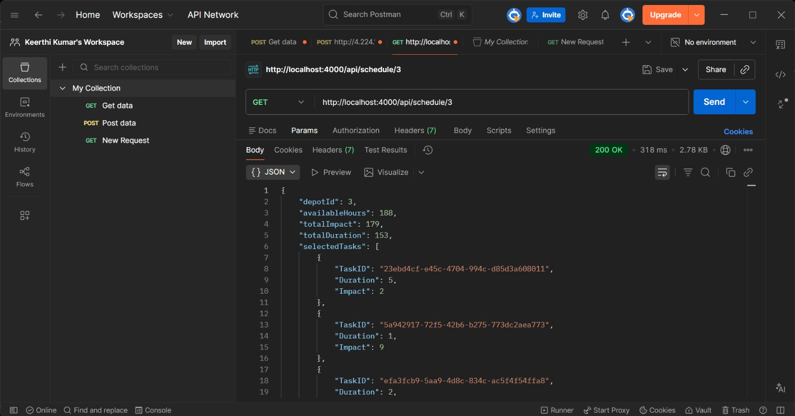

# 22MIS0080

Backend services built for the campus hiring evaluation. The repo contains three independent modules — a reusable logging middleware, a vehicle maintenance optimization service, and a notification system design with a working priority inbox backend.

## Folder Structure

```
22MIS0080/
├── logging_middleware/         # Reusable centralized logging package
│   ├── logger.js
│   ├── validator.js
│   ├── constants.js
│   └── package.json
│
├── vehicle_maintenance_scheduler/   # Optimization microservice
│   ├── algorithms/
│   │   └── scheduler.js             # 0/1 Knapsack DP engine
│   ├── controllers/
│   │   └── scheduleController.js
│   ├── services/
│   │   ├── depotService.js
│   │   └── vehicleService.js
│   ├── routes/
│   │   └── scheduleRoutes.js
│   ├── screenshots/
│   └── app.js
│
├── notification_app_be/        # Priority inbox backend
│   ├── algorithms/
│   │   ├── priorityEngine.js
│   │   └── topNotifications.js
│   ├── controllers/
│   │   └── priorityController.js
│   ├── services/
│   │   └── notificationService.js
│   ├── routes/
│   │   └── priorityRoutes.js
│   └── app.js
│
├── notification_system_design.md    # Theoretical design (Stages 1–5)
├── .gitignore
└── README.md
```

## Logging Middleware

A standalone, reusable logging package that talks to a protected external log API. Any service in the repo can import it and call `Log(stack, level, pkg, message)`.

- Validates parameters against allowed enums before making any request
- Uses `axios` with a 5-second `AbortController` timeout
- Reads `AUTH_TOKEN` from environment variables
- Returns structured `{ success, data }` or `{ success, error }` objects
- No `console.log` anywhere — uses `process.stdout.write` / `process.stderr.write`

## Vehicle Maintenance Scheduler

The core optimization problem: given a set of vehicle maintenance tasks (each with a `Duration` and `Impact`) and a depot with limited `MechanicHours`, pick the subset of tasks that maximizes total impact without exceeding available hours.

This maps directly to the **0/1 Knapsack Problem**:

| Knapsack Term | Domain Term    |
|---------------|----------------|
| Weight        | Duration       |
| Value         | Impact         |
| Capacity      | MechanicHours  |

The solution uses bottom-up dynamic programming with backtracking to recover selected tasks. Time complexity is `O(n × capacity)` where `n` is the number of tasks.

**Endpoint:** `GET /api/schedule/:depotId`

The controller fetches depots and vehicles from the external API, locates the requested depot, runs the DP algorithm against that depot's mechanic hours, and returns the optimized schedule.

## Notification System Design

The `notification_system_design.md` file covers five stages of backend system design:

1. **REST API Design** — endpoints, schemas, auth assumptions, SSE for realtime
2. **Database Design** — PostgreSQL tables, normalization, indexing strategy, Redis caching
3. **Query Optimization** — compound index design, full table scan analysis, ORDER BY optimization
4. **Database Overload** — caching, pagination, lazy loading, background sync
5. **Mass Delivery** — message queues, workers, retries, dead-letter queues, idempotency

## Priority Inbox

A working backend that fetches notifications from the external API and ranks them using a scoring function.

**Scoring logic:**
- Base score by type: `Placement = 10000`, `Result = 5000`, `Event = 1000`
- Recency penalty: subtract 1 point per hour of age
- This ensures a 10-day old Placement still outranks a brand new Event

Filters for unread notifications, sorts by score descending, returns top N.

**Endpoint:** `GET /api/priority/:count`

## Tech Stack

- Node.js (CommonJS)
- Express
- Axios
- dotenv

## Setup

```bash
# Install dependencies for each service
cd logging_middleware && npm install && cd ..
cd vehicle_maintenance_scheduler && npm install && cd ..
cd notification_app_be && npm install && cd ..
```

Create a `.env` file in the project root:

```
AUTH_TOKEN=your_bearer_token_here
EVALUATION_SERVICE_URL=http://4.224.186.213/evaluation-service
```

Run the services:

```bash
# Vehicle scheduler (port 4000)
cd vehicle_maintenance_scheduler && node app.js

# Notification priority inbox (port 5000)
cd notification_app_be && node app.js
```

## Screenshots

### Vehicle Maintenance Scheduler — Depot 3


### Vehicle Maintenance Scheduler — Depot 5


### Priority Inbox — Top 5 Notifications


### Priority Inbox — Top 10 Notifications


## Engineering Notes

- Modular folder structure — controllers, services, routes, algorithms are separated
- Centralized logging via shared middleware package
- No `console.log` usage across the entire codebase
- Environment variables for all secrets and config
- Proper error handling with structured error responses
- Each service runs independently on its own port
